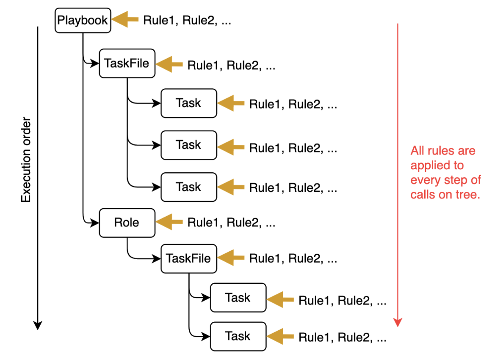
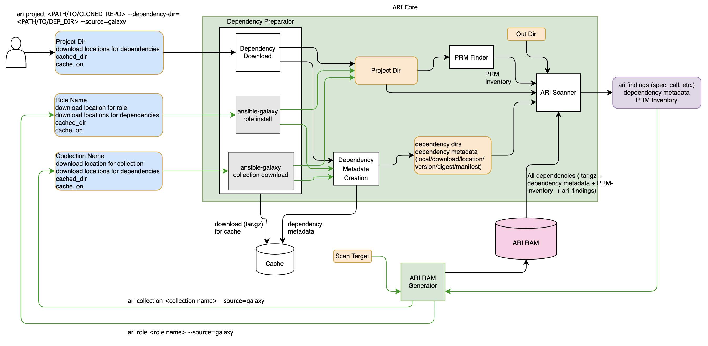

# Ansible Risk Insight

Ansible Risk Insight (ARI) is the tool to evaluate the quality and risk of the ansible content. It works as a CLI tool, but can be integrated as python module. ARI can take Ansible content files such as playbooks, projects, collections and roles as inputs, then parse it to create a call tree in a static analysis fashion. 


ARI can apply rules to evaluate quality and risk for the tasks, roles, playbooks and taskfiles on the call tree. 



ARI has default set of [rules](https://ansible.github.io/ansible-risk-insight/), and users can easily define new rules (see the [guide](https://github.com/ansible/ansible-risk-insight/blob/main/docs/customize_rules.md)). `match()` function defines which nodes in the call tree the rule should be applied to. In this example, the rule is applied only for all tasks. The `process()` function defines what should be computed, determined, and possibly changed.

ARI simulates the execution and goes through all nodes of the call tree in order, and the context when running the task is provided to the process() function. The context of a task includes the information about the current task spec, call tree, and all variables defined before the task (see the example below). ARI can consider all variable assignments and its precedence order.

There are different types of rules. 
- Validating rule: a rule to compute verdict to validate the task content
- Information rule: a rule to derive something about the task content. The result is reported as the rule result. 
- Mutating rule: a rule to apply some changes to the task content

All rules are applied to every step of execution in a sequential order. Each rule can attach information to the tree nodes. It is called an “annotation”, which can be referred to from other rules. 

To create the useful annotations, the ARI can crawl the external sources such as Ansible Galaxy, Automation Hub, Github repository, local directly, etc to enrich the knowledge base available for rules. ARI pre-computes scanning result for the crawled content and stores it in a data store (called "RAM"), which keeps
- Collections, roles, tasks, modules 
- Metadata (digest, signature, timestamp, versions, repo url, license, etc.)
- Module spec (acquired from module document via ansible-doc command)
- Rule results from ARI




## Prerequisites
Currently this documentation assumes the following prerequisites.

- pip command
- ansible-galaxy command
- ansible-doc command

## Install

You can install ARI from GitHub source code using `pip` command.

```bash
$ pip install git+https://github.com/ansible/ansible-risk-insight.git
```

## How to try

### Role
```
ansible-risk-insight role <role_name>
```

### Collection (now fixing an issue)
```
ansible-risk-insight collection <collection_name>
```

All intermediate files are installed under a temporary directory.
The src directory which includes dependency collections and roles are moved under command directory for ARI to avoid repeated install from Galaxy repository.
The location of the ARI common directory can be specified by environment variable `ARI_DATA_DIR` (default = /tmp/ari-data).

## Prepare backend data

ARI can crawl the external sources such as Ansible Galaxy to enrich the knowledge base (called RAM) available for rules. ARI pre-computes scanning result for the crawled content and stores it in a data store (called "RAM"), which keeps
- Collections, roles, tasks, modules 
- Metadata (digest, signature, timestamp, versions, repo url, license, etc.)
- Module spec (acquired from module document via ansible-doc command)
- Findings from ARI

For example, you can setup the RAM by the following command. The files are created under `ARI_DATA_DIR`.

```bash
# create a text file for the input
$ cat << EOS > ram_input_list.txt
collection amazon.aws
collection azure.azcollection
collection google.cloud
collection arista.eos
collection junipernetworks.junos
collection containers.podman
collection ansible.builtin
collection community.general
collection ansible.posix
collection arista.avd
EOS

# prepare the backend data based on the input
$ ari ram generate -f ram_input_list.txt

(this takes a while...)

```

## Installation (for development)

```
git clone git@github.com:ansible/ansible-risk-insight.git
cd ansible-risk-insight
pip install -e .
```
